# Домашнее задание к занятию «Введение в Terraform» - Никоноров Денис FOPS-6

## Задание 1
* Перейдите в каталог src. Скачайте все необходимые зависимости, использованные в проекте.

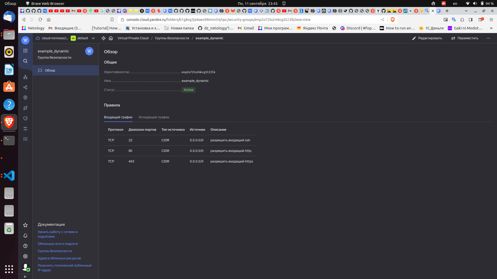

* Изучите файл .gitignore. В каком terraform файле согласно этому .gitignore допустимо сохранить личную, секретную информацию?

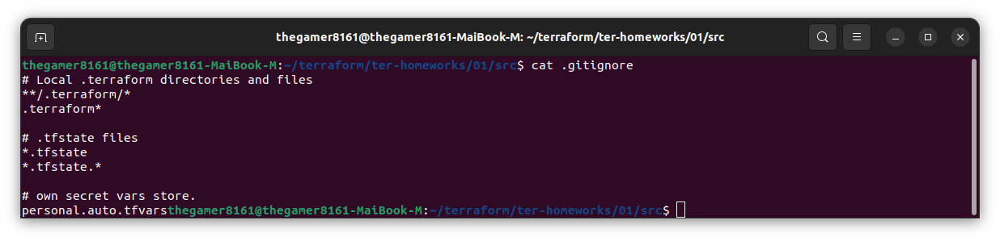

```personal.auto.tfvars - позволяет именовать файлы с переменными (с секретными данными)```

* Выполните код проекта. Найдите в State-файле секретное содержимое созданного ресурса random_password, пришлите в качестве ответа конкретный ключ и его значение.

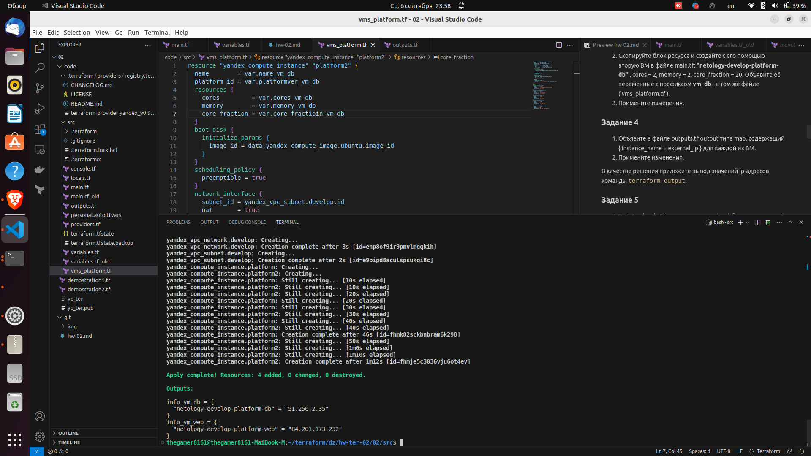

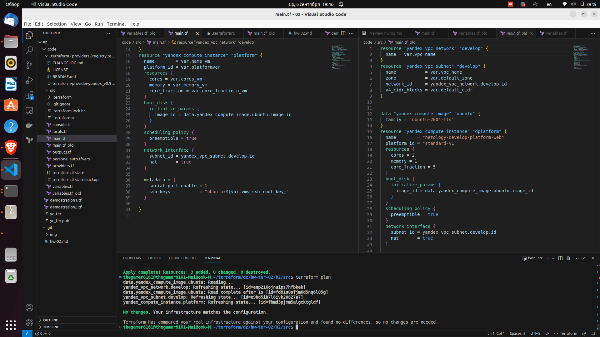

* Раскомментируйте блок кода, примерно расположенный на строчках 29-42 файла main.tf. Выполните команду terraform validate. Объясните в чем заключаются намеренно допущенные ошибки? Исправьте их.

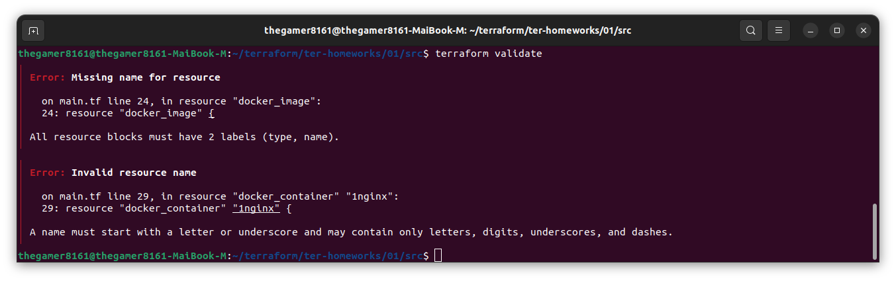

1. Error: Missing name for resource (Ошибка: Отсутствует имя для ресурса)

Для исправления добавить имя nginx

```
resource "docker_image" "nginx" {
  name         = "nginx:latest"
  keep_locally = true
}

```

2. Error: Invalid resource name (Неверное имя ресурса, 1nginx имя должно начинаться с буквы)

Исправление ошибки

```
resource "docker_container" "nginx" {
  image = docker_image.nginx.image_id
  name  = "example_${random_password.random_string_fake.resuld}"

  ports {
    internal = 80
    external = 8000
  }
}
```

* Выполните код. В качестве ответа приложите вывод команды docker ps

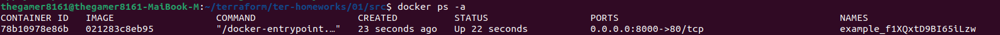

* Замените имя docker-контейнера в блоке кода на hello_world, выполните команду terraform apply -auto-approve. Объясните своими словами, в чем может быть опасность применения ключа -auto-approve ? В качестве ответа дополнительно приложите вывод команды docker ps

```terraform apply -auto-approve``` - Пропускает интерактивное утверждение плана перед применением

Если случайно запустить данную команду то любые изменения, включая удаление или изменение инфрастуктуры, будут автоматом применены без возможности отмены. Применять с **ОСТОРОЖНОСТЬЮ!!!**.

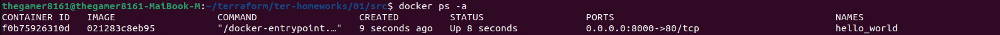

* Уничтожьте созданные ресурсы с помощью terraform. Убедитесь, что все ресурсы удалены. Приложите содержимое файла terraform.tfstate.

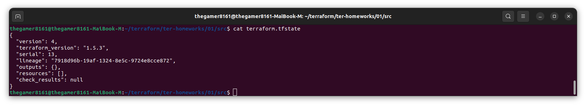

* Объясните, почему при этом не был удален docker образ nginx:latest ? Ответ подкрепите выдержкой из документации провайдера.

Keep_locally - Необязательное логическое значение если true, то образ докера не будет удален при операции destroy. Если значение false, он удалит image из локального хранилища докера при destroy

## Задание 2

1. Изучите в документации provider Virtualbox от shekeriev.
2. Создайте с его помощью любую виртуальную машину. Чтобы не использовать VPN советуем выбрать любой образ с расположением в github из списка
* В качестве ответа приложите plan для создаваемого ресурса и скриншот созданного в VB ресурса.

1. shekeriev у меня не заработать а заработал ```source = "terra-farm/virtualbox" version = "0.2.2-alpha.1"```

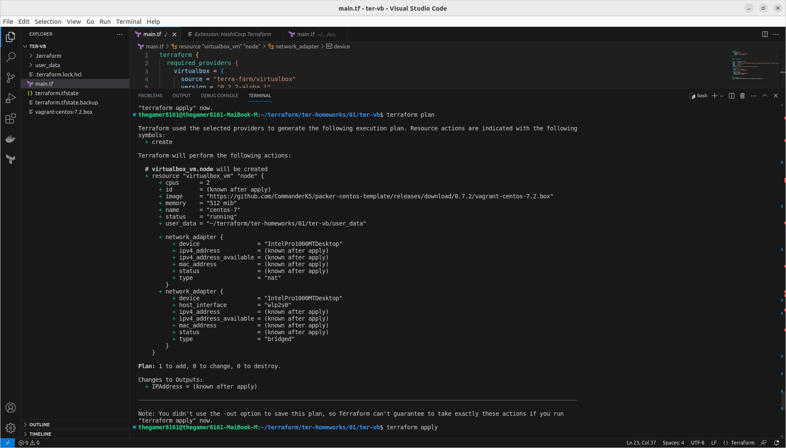
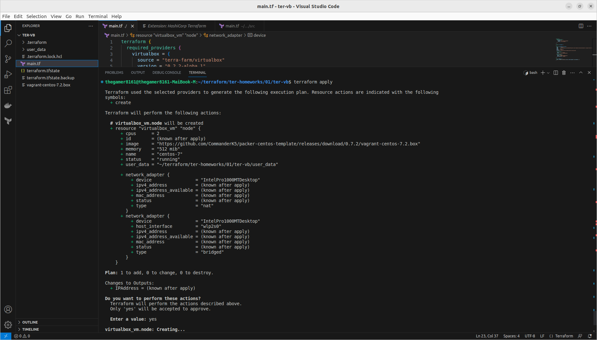
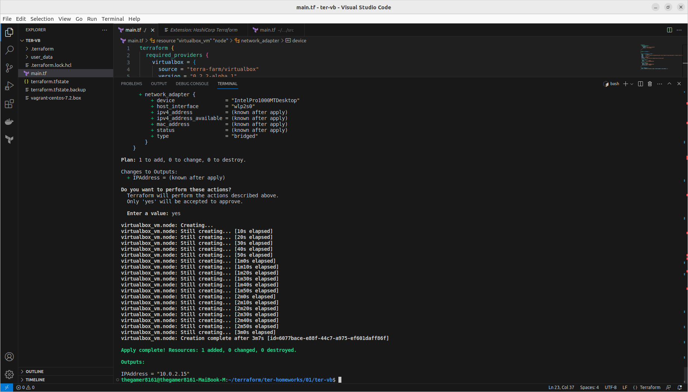
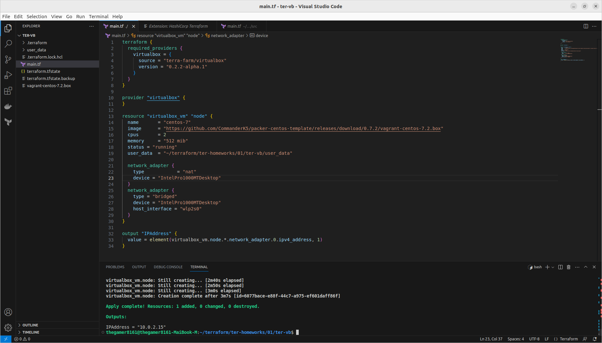
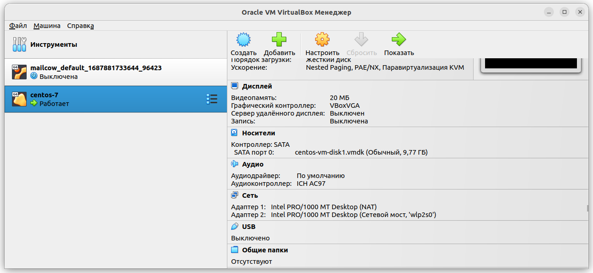
