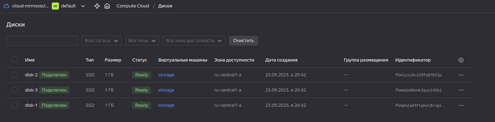

# Никоноров Денис - FOPS-6
# Домашнее задание к занятию "Управляющие конструкции в коде Terraform"


### Задание 1

1. Изучите проект.
2. Заполните файл personal.auto.tfvars
3. Инициализируйте проект, выполните код (он выполнится даже если доступа к preview нет).

Примечание: Если у вас не активирован preview доступ к функционалу "Группы безопасности" в Yandex Cloud - запросите доступ у поддержки облачного провайдера. Обычно его выдают в течении 24-х часов.

Приложите скриншот входящих правил "Группы безопасности" в ЛК Yandex Cloud  или скриншот отказа в предоставлении доступа к preview версии.

**Ответ.**


---

### Задание 2

1. Создайте файл count-vm.tf. Опишите в нем создание двух **одинаковых** ВМ  web-1 и web-2(не web-0 и web-1!), с минимальными параметрами, используя мета-аргумент **count loop**. Назначьте ВМ созданную в 1-м задании группу безопасности.
2. Создайте файл for_each-vm.tf. Опишите в нем создание 2 ВМ с именами "main" и "replica" **разных** по cpu/ram/disk , используя мета-аргумент **for_each loop**. Используйте для обеих ВМ одну, общую переменную типа list(object({ vm_name=string, cpu=number, ram=number, disk=number  })). При желании внесите в переменную все возможные параметры.
3. ВМ из пункта 2.2 должны создаваться после создания ВМ из пункта 2.1.
4. Используйте функцию file в local переменной для считывания ключа ~/.ssh/id_rsa.pub и его последующего использования в блоке metadata, взятому из ДЗ №2.
5. Инициализируйте проект, выполните код.

**Ответ.**

<details><summary>count_vm.tf</summary>

```tf
resource "yandex_compute_instance" "vm_web" {
  count                     = 2
  name                      = format("web-%01d", count.index + 1)
  hostname                  = format("web-%01d", count.index + 1)
  description               = format("web-%01d", count.index + 1)
  zone                      = var.default_zone
  folder_id                 = var.folder_id

  platform_id = var.web_platform_id
  allow_stopping_for_update = true
  
  resources {
    cores         = var.vms_resources["vm_web_resources"]["cores"]
    memory        = var.vms_resources["vm_web_resources"]["memory"]
    core_fraction = var.vms_resources["vm_web_resources"]["core_fraction"]
  }

  boot_disk {
    initialize_params {
      image_id = data.yandex_compute_image.debian_11.id
      type     = "network-ssd"
      size     = "15"
    }
  }

  network_interface {
    subnet_id  = yandex_vpc_subnet.develop.id
    nat        = true
    security_group_ids = [ yandex_vpc_security_group.example.id ]
  }

  metadata = {
    ssh-keys = "debian:${local.ssh_file}"
  }

  scheduling_policy {
    preemptible = true
  }
}
```

</details>

<details><summary>for_each-vm.tf</summary>

```tf
resource "yandex_compute_instance" "vm_web_2" {
  depends_on = [ yandex_compute_instance.vm_web ]
  for_each = { for vm in var.vms_list : vm.vm_name => vm }
  name                      = each.value.vm_name
  hostname                  = each.value.vm_hostname
  description               = each.value.vm_discription
  zone                      = var.default_zone
  folder_id                 = var.folder_id

  platform_id = var.web_platform_id
  allow_stopping_for_update = true
  
  resources {
    cores         = each.value.cpu
    memory        = each.value.ram
    core_fraction = each.value.core_fraction
  }

  boot_disk {
    initialize_params {
      image_id = data.yandex_compute_image.debian_11.id
      type     = each.value.disk_type
      size     = each.value.disk
    }
  }

  network_interface {
    subnet_id  = yandex_vpc_subnet.develop.id
    nat        = true
    security_group_ids = [ yandex_vpc_security_group.example.id ]
  }

  metadata = {
    ssh-keys = "${each.value.ssh_user}:${local.ssh_file}"
  }

  scheduling_policy {
    preemptible = true
  }
}
```

</details>

<details><summary>locals.tf</summary>

```tf
locals {
  ssh_file = file("~/.ssh/id_rsa.pub")
}
```

</details>

<details><summary>variables.tf (новый фрагмент)</summary>

```tf
variable "web_platform_id" {
  type        = string
  default     = "standard-v1"
  description = "VM platform"
}

variable "vms_resources" {
  description = "common configs to VMs"
  type = map(object({
    cores         = number
    memory        = number
    core_fraction = number
  }))
  default = {
    vm_web_resources = {
      cores         = 2
      memory        = 1
      core_fraction = 5
    }
  }
}

variable "vms_list" {
  description = "common configs to VMs"
  type = list(object({
    vm_name        = string
    vm_hostname    = string
    vm_discription = string
    cpu            = number
    ram            = number
    disk           = number
    disk_type      = string
    core_fraction  = number
    ssh_user       = string
    })
  )
  default = [
    {
      vm_name        = "main"
      vm_hostname    = "main"
      vm_discription = "main"
      cpu            = 2
      ram            = 1
      disk           = 10
      disk_type      = "network-ssd"
      core_fraction  = 5
      ssh_user       = "debian"
    },
    {
      vm_name        = "replica"
      vm_hostname    = "replica"
      vm_discription = "replica"
      cpu            = 4
      ram            = 2
      disk           = 11
      disk_type      = "network-hdd"
      core_fraction  = 5
      ssh_user       = "debian"
    }
  ]
}
```

</details>


---

### Задание 3

1. Создайте 3 одинаковых виртуальных диска, размером 1 Гб с помощью ресурса yandex_compute_disk и мета-аргумента count в файле **disk_vm.tf** .
2. Создайте в том же файле одну ВМ c именем "storage" . Используйте блок **dynamic secondary_disk{..}** и мета-аргумент for_each для подключения созданных вами дополнительных дисков.

**Ответ.**

<details><summary>disk_vm.tf</summary>

```tf
resource "yandex_compute_disk" "disks" {
  count = 3
  name  = format("disk-%01d", count.index + 1)
  type  = "network-ssd"
  size  = 1
  zone  = var.default_zone

  labels = {
    environment = "netology"
  }
}

resource "yandex_compute_instance" "vm_storage" {
  count       = 1
  name        = "storage"
  hostname    = "storage"
  description = "storage"
  zone        = var.default_zone
  folder_id   = var.folder_id

  platform_id               = var.web_platform_id
  allow_stopping_for_update = true

  resources {
    cores         = 2
    memory        = 1
    core_fraction = 5
  }

  boot_disk {
    initialize_params {
      image_id = data.yandex_compute_image.debian_11.id
      type     = "network-ssd"
      size     = "15"
    }
  }

  dynamic "secondary_disk" {
    for_each = yandex_compute_disk.disks.*.id
    content {
      disk_id = secondary_disk.value
    }
  }

  network_interface {
    subnet_id          = yandex_vpc_subnet.develop.id
    nat                = true
    security_group_ids = [yandex_vpc_security_group.example.id]
  }

  metadata = {
    ssh-keys = "debian:${local.ssh_file}"
  }

  scheduling_policy {
    preemptible = true
  }
}

```

</details>




---

### Задание 4

1. В файле ansible.tf создайте inventory-файл для ansible.
Используйте функцию tepmplatefile и файл-шаблон для создания ansible inventory-файла из лекции.
Передайте в него в качестве переменных группы виртуальных машин из задания 2.1, 2.2 и 3.2.(т.е. 5 ВМ)
2. Инвентарь должен содержать 3 группы [webservers], [databases], [storage] и быть динамическим, т.е. обработать как группу из 2-х ВМ так и 999 ВМ.
4. Выполните код. Приложите скриншот получившегося файла. 

Для общего зачета создайте в вашем GitHub репозитории новую ветку terraform-03. Закомитьте в эту ветку свой финальный код проекта, пришлите ссылку на коммит.   
**Удалите все созданные ресурсы**.

**Ответ.**

<details><summary>ansible.tf</summary>

```tf
resource "local_file" "hosts_cfg" {
  content = templatefile("${path.module}/hosts.tftpl",

    {
      webservers = yandex_compute_instance.vm_web,
      databases  = yandex_compute_instance.vm_web_2,
      storage    = yandex_compute_instance.vm_storage,
    }
  )
  filename = "${abspath(path.module)}/hosts.cfg"
}
```

</details>

<details><summary>hosts.tftpl</summary>

```c
[webservers]
%{~ for i in webservers ~}

${i["name"]}   ansible_host=${i["network_interface"][0]["nat_ip_address"]} 
%{~ endfor ~}


[databases]
%{~ for i in databases ~}

${i["name"]}   ansible_host=${i["network_interface"][0]["nat_ip_address"]} 
%{~ endfor ~}


[storage]
%{~ for i in storage ~}

${i["name"]}   ansible_host=${i["network_interface"][0]["nat_ip_address"]} 
%{~ endfor ~}
```

</details>


**[ссылка на код](https://gitlab.infernofeniks.ru/feniks/gitlab-hw-16-1/-/tree/terraform-03/03/src)**

---

## Дополнительные задания (со звездочкой*)

**Настоятельно рекомендуем выполнять все задания под звёздочкой.**   Их выполнение поможет глубже разобраться в материале.   
Задания под звёздочкой дополнительные (необязательные к выполнению) и никак не повлияют на получение вами зачета по этому домашнему заданию. 

### Задание 5*(необязательное)
1. Напишите output, который отобразит все 5 созданных ВМ в виде списка словарей:
``` 
[
 {
  "name" = 'имя ВМ1'
  "id"   = 'идентификатор ВМ1'
  "fqdn" = 'Внутренний FQDN ВМ1'
 },
 {
  "name" = 'имя ВМ2'
  "id"   = 'идентификатор ВМ2'
  "fqdn" = 'Внутренний FQDN ВМ2'
 },
 ....
]
```
Приложите скриншот вывода команды ```terrafrom output```

**Ответ.**

<details><summary>outputs.tf</summary>

```tf
output "virtual_machines_info" {
  value = [
    for instance in concat(tolist(yandex_compute_instance.vm_storage), tolist(yandex_compute_instance.vm_web), tolist(values(yandex_compute_instance.vm_web_2))) : {
      name = instance.name
      id   = instance.id
      fqdn = instance.fqdn
    }
  ]
}
```

</details>


---

### Задание 6*(необязательное)

1. Используя null_resource и local-exec примените ansible-playbook к ВМ из ansible inventory файла.
2. Дополните файл шаблон hosts.tftpl. 
Формат готового файла:
```netology-develop-platform-web-0   ansible_host="<внешний IP-address или внутренний IP-address если у ВМ отсутвует внешний адрес>"```

Для проверки работы уберите у ВМ внешние адреса. Этот вариант используется при работе через bastion сервер.
Для зачета предоставьте код вместе с основной частью задания.

**Ответ.**

<details><summary>ansible.tf</summary>

```tf
resource "local_file" "hosts_cfg" {
  content = templatefile("${path.module}/hosts.tftpl",

    {
      webservers = yandex_compute_instance.vm_web,
      databases  = yandex_compute_instance.vm_web_2,
      storage    = yandex_compute_instance.vm_storage,
    }
  )
  filename = "${abspath(path.module)}/hosts.cfg"
}

resource "null_resource" "web_hosts_provision" {

depends_on = [ yandex_compute_instance.vm_web_2, yandex_compute_instance.vm_storage ]

  provisioner "local-exec" {                  
    command  = "export ANSIBLE_HOST_KEY_CHECKING=False; ansible-playbook -i ${abspath(path.module)}/hosts.cfg ${abspath(path.module)}/test.yml"
    on_failure = continue
    environment = { ANSIBLE_HOST_KEY_CHECKING = "False" }
  }
    triggers = {  
      always_run         = "${timestamp()}" #всегда т.к. дата и время постоянно изменяются
      playbook_src_hash  = file("${abspath(path.module)}/test.yml") # при изменении содержимого playbook файла
      ssh_public_key     = local.ssh_file # при изменении переменной
    }
}
```

</details>

<details><summary>test.yml</summary>

```yml
---

- name: test
  gather_facts: false
  hosts: all
  vars:
    ansible_user: debian
  become: yes
  tasks:
  
  - name: Wait for SSH port to become available
    wait_for:
      host: "{{ ansible_host }}"
      port: 22
      delay: 10
      timeout: 300

  - name: Install Nginx Web Server on Debian Family
    apt:
      name: nginx
      state: latest   
      update_cache: yes 
    
```

</details>


Дополнил файл-шаблон `hosts.tftpl`.

<details><summary>hosts.tftpl</summary>

```c
[webservers]
%{~ for i in webservers ~}

netology-develop-platform-${i["name"]}   ansible_host=${(length(i["network_interface"][0]["nat_ip_address"]) > 0 ? i["network_interface"][0]["nat_ip_address"] : i["network_interface"][0]["ip_address"])} 
%{~ endfor ~}

[databases]
%{~ for i in databases ~}

netology-develop-platform-${i["name"]}   ansible_host=${(length(i["network_interface"][0]["nat_ip_address"]) > 0 ? i["network_interface"][0]["nat_ip_address"] : i["network_interface"][0]["ip_address"])} 
%{~ endfor ~}


[storage]
%{~ for i in storage ~}

netology-develop-platform-${i["name"]}   ansible_host=${(length(i["network_interface"][0]["nat_ip_address"]) > 0 ? i["network_interface"][0]["nat_ip_address"] : i["network_interface"][0]["ip_address"])} 
%{~ endfor ~}
```
</details>

Изменил значение VM STORAGE `nat = false`:


---

### Правила приема работы

В своём git-репозитории создайте новую ветку terraform-03, закомитьте в эту ветку свой финальный код проекта. Ответы на задания и необходимые скриншоты оформите в md-файле в ветке terraform-03.

В качестве результата прикрепите ссылку на ветку terraform-03 в вашем репозитории.

ВАЖНО!Удалите все созданные ресурсы.